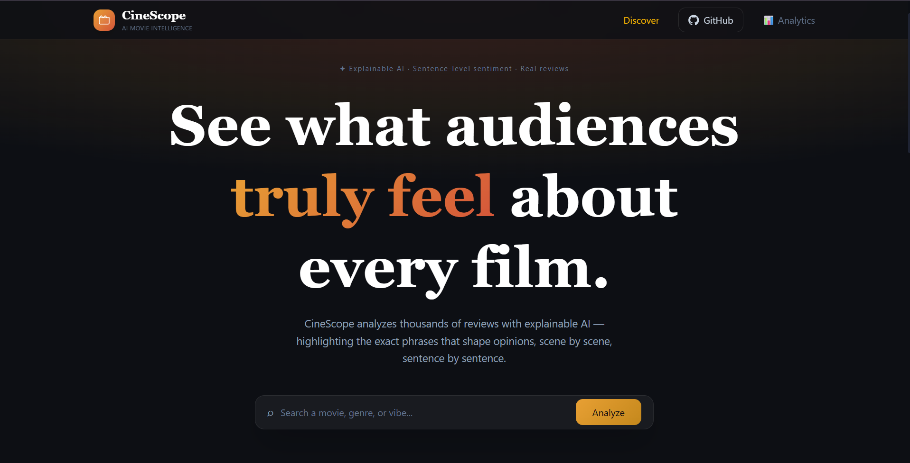
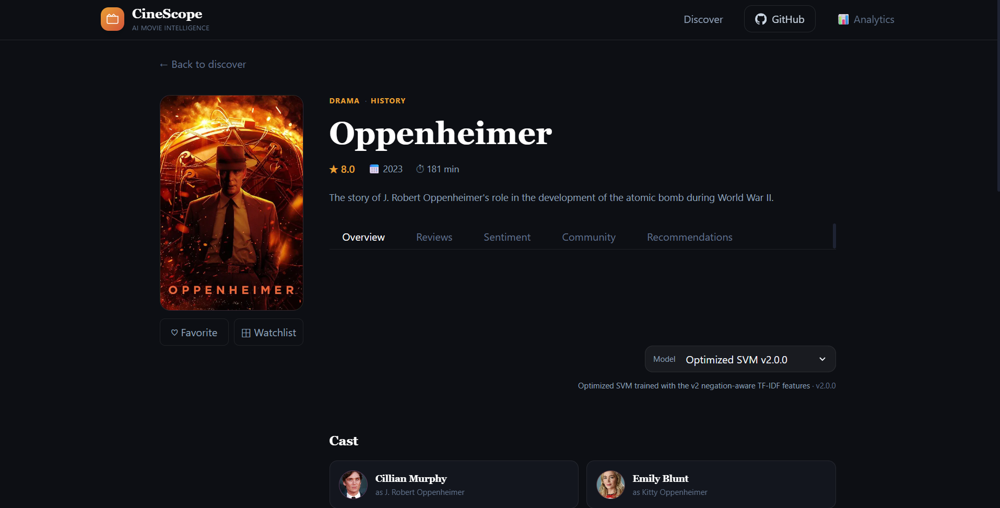
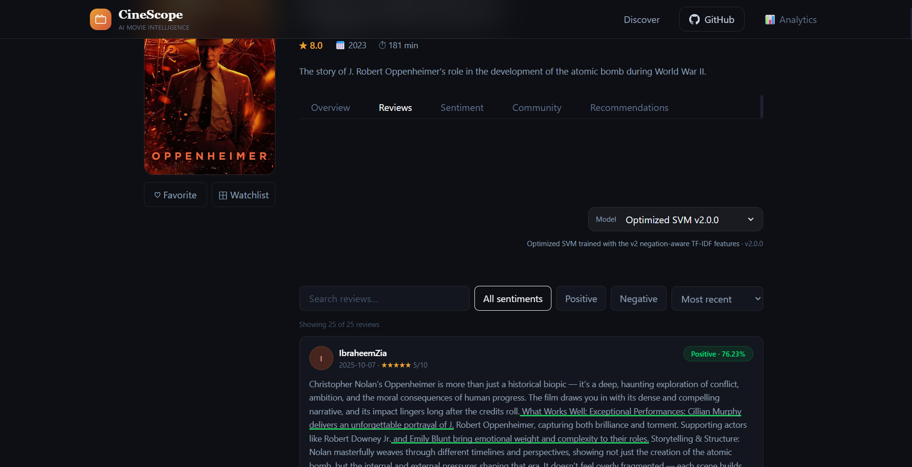
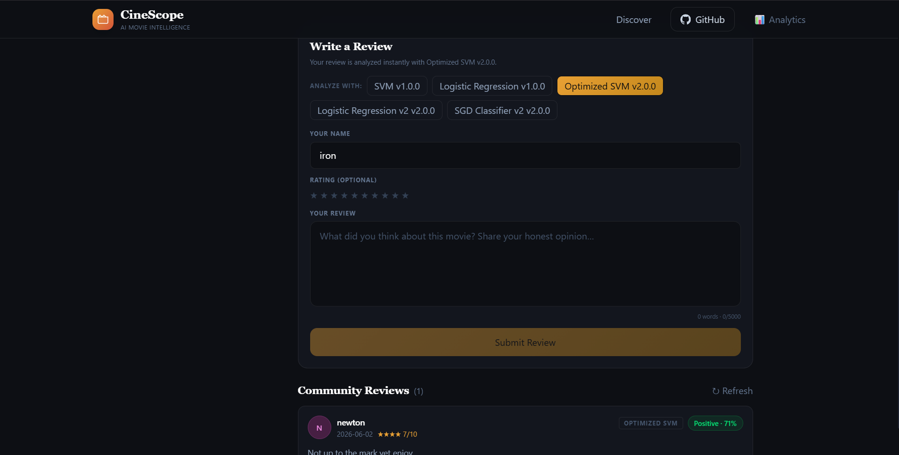
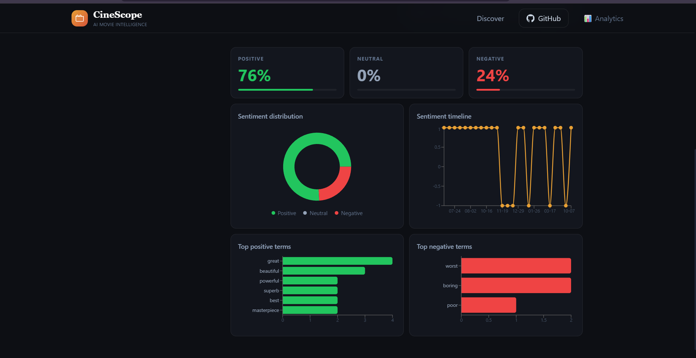
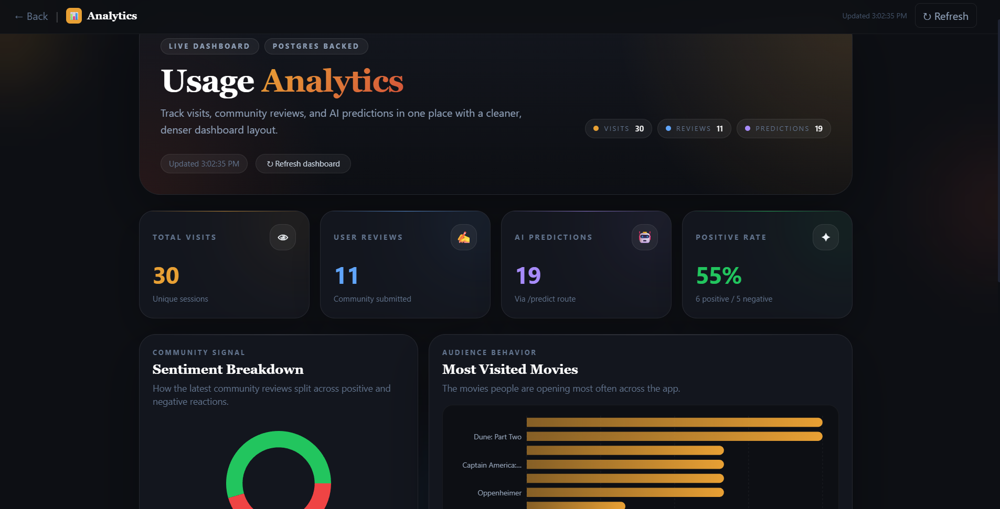

# 🎬 CineScope – Full-Stack AI Movie Analytics & Sentiment Intelligence Platform

CineScope is a full-stack AI-powered movie analytics platform that combines Machine Learning, Deep Learning, Natural Language Processing (NLP), and modern web technologies to analyze movie reviews and uncover audience sentiment in real time.

Built using React, FastAPI, Supabase, and multiple sentiment classification models trained on the IMDb 50K Reviews Dataset, CineScope enables users to discover movies, analyze reviews, compare sentiment models, and gain community-driven insights through an interactive web interface.

🌐 **Live Demo:** https://movie-sentiment-analysis-azure.vercel.app/

---

### 🏠 Home Page



## 🚀 Key Features

### 🎥 Movie Discovery

* Search movies using TMDB integration
* View detailed movie information
* Explore ratings, genres, posters, and metadata

### 🤖 AI Sentiment Analysis

* Analyze user-written movie reviews
* Predict Positive or Negative sentiment instantly
* Real-time inference using trained ML models
* Advanced NLP preprocessing pipeline

### 🔄 Model Comparison

* Switch between multiple trained models
* Compare sentiment predictions
* Evaluate different ML approaches interactively

### 📊 Community Sentiment Analytics

* Aggregate community reviews
* Analyze overall audience perception
* Track sentiment trends across movies

### 📝 Review Management

* Store reviews in Supabase PostgreSQL
* Retrieve historical sentiment data
* Build community-driven sentiment profiles

### 📈 Analytics Dashboard

* Sentiment distribution visualization
* Community review statistics
* Movie-specific audience insights

---

## 🧠 Machine Learning & Deep Learning Models

The platform supports multiple machine learning and deep learning models for sentiment classification.

### Traditional Machine Learning Models

| Model                    | Accuracy   | Precision | Recall     | F1 Score   |
| ------------------------ | ---------- | --------- | ---------- | ---------- |
| Optimized SVM v2.0       | **90.17%** | 89.20%    | 91.46%     | **90.31%** |
| Logistic Regression v2.0 | 90.07%     | 89.18%    | 91.27%     | 90.21%     |
| SGD Classifier v2.0      | 89.89%     | 88.50%    | **91.76%** | 90.10%     |
| Random Forest            | 85.47%     | 85.27%    | 85.87%     | 85.57%     |
| KNN                      | 76.89%     | 73.35%    | 84.70%     | 78.62%     |

### Deep Learning Models

| Model                  | Accuracy   | Precision  | Recall     | F1 Score   |
| ---------------------- | ---------- | ---------- | ---------- | ---------- |
| Conv1D                 | **89.11%** | **91.78%** | 85.99%     | **88.79%** |
| Conv1D + BiLSTM Hybrid | 88.80%     | 86.95%     | **91.38%** | 89.11%     |
| Bidirectional LSTM     | 88.38%     | 86.53%     | 91.01%     | 88.71%     |

### 🏆 Best Performing Model

**Optimized SVM v2.0**

* Accuracy: 90.17%
* Precision: 89.20%
* Recall: 91.46%
* F1 Score: 90.31%

The Optimized SVM model achieved the highest overall performance and is deployed for real-time sentiment prediction.

---

## 🔄 Available Models in Application

Users can switch between multiple trained models directly from the interface:

* SVM v1.0
* Optimized SVM v2.0
* Logistic Regression v1.0
* Logistic Regression v2.0
* SGD Classifier v2.0

This allows interactive comparison of model predictions and performance.

---

## 🏗️ System Architecture

```text
                     User
                       │
                       ▼
             React + Vite Frontend
                       │
                       ▼
                 FastAPI Backend
                       │
       ┌───────────────┼───────────────┐
       ▼               ▼               ▼
   TMDB API      Sentiment Models   Supabase
 (Movie Data)      (ML + DL)       PostgreSQL
       │               │               │
       └───────────────┴───────────────┘
                       │
                       ▼
               Analytics Dashboard
```

---

## 🛠️ Tech Stack

### Frontend

* React.js
* Vite
* JavaScript
* HTML5
* CSS3

### Backend

* FastAPI
* Python

### Machine Learning & NLP

* Scikit-Learn
* TensorFlow
* Keras
* NLTK
* TF-IDF Vectorization

### Database

* Supabase
* PostgreSQL

### External APIs

* TMDB API

### Deployment

* Vercel (Frontend)
* Render (Backend API)
* Supabase (Database)

---

## 📂 Project Structure

```text
movie-sentiment-analysis/
│
├── backend/
│   ├── services/
│   ├── app.py
│   ├── database.py
│   ├── models.py
│   └── preprocessing.py
│
├── frontend/
│   ├── public/
│   ├── src/
│   ├── package.json
│   └── vite.config.js
│
├── dataset/
├── notebooks/
│
├── models/
│   ├── best_svm_sentiment.pkl
│   ├── optimized_svm_sentiment_v2.pkl
│   ├── logistic_regression_sentiment_v2.pkl
│   ├── sgd_sentiment_v2.pkl
│   ├── bilstm_sentiment_model_v3.keras
│   ├── conv1d_sentiment_model_v3.keras
│   └── conv_bilstm_sentiment_model_v3.keras
│
└── README.md
```

---

## 📊 Dataset

The models were trained and evaluated using the IMDb 50K Movie Reviews Dataset, one of the most widely used benchmark datasets for sentiment analysis.

Dataset Characteristics:

* 50,000 labeled movie reviews
* Balanced positive and negative classes
* Real-world user-generated reviews
* Benchmark dataset for NLP research

---

## 📸 Application Screenshots

### 🏠 Home Page


### 🎥 Movie Search



### 🤖 Sentiment Prediction



### 👥 Community Sentiment



### 👥 Community Sentiment



### 📊 Analytics Dashboard



---


## 🔮 Future Improvements

* Transformer-based models (BERT, RoBERTa)
* Personalized movie recommendations
* User authentication and profiles
* Sentiment trend forecasting
* Docker containerization
* CI/CD pipeline integration
* Explainable AI (XAI) for sentiment predictions

---

## 👨‍💻 Author

**Shaurya Priyam**

GitHub: https://github.com/ShauryaPriyam

Project: CineScope – AI Movie Analytics Platform

---

⭐ If you found this project useful, consider giving it a star on GitHub.
